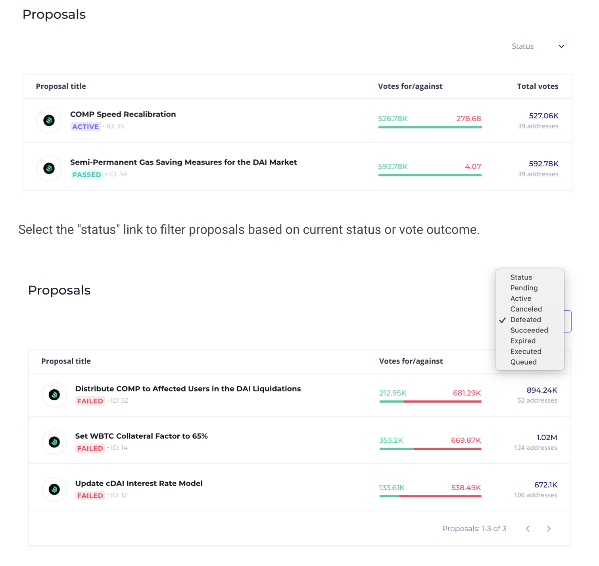

# Table of contents

* [Repository Overview](../README.md)
* [Introduction](#introduction)
    * [Snapshot](#)
    * [Tally](#tally)
* [Eul](#eul)
* [Delegate](#delegate)
* [Delegate by Signature](#delegate-by-signature)
* [Get Current Votes](#get-current-votes)
* [Get Prior Votes](#get-prior-votes)
* [Key Events](#key-events)
* [Quorum Votes](#quorum-votes)
* [Proposal Threshold](#proposal-threshold)
* [Proposal Max Operations](#proposal-max-operations)
* [Voting Delay](#voting-delay)
* [Voting Period](#voting-period)
* [Propose](#propose)
* [Queue](#queue)
* [Execute](#execute)
* [Cancel](#cancel)
* [Get Actions](#get-actions)
* [Get Receipt](#get-receipt)
* [State](#state)
* [Cast Vote](#cast-vote)
* [Cast Vote By Signature](#cast-vote-by-signature)
* [Timelock](#timelock)
* [Guardian](#)


## Introduction

The [Euler protocol](https://www.euler.xyz/) is governed and upgraded by EUL token-holders, using three distinct components; the EUL token, governance module, and Timelock. Together, these contracts allow the community to propose, vote, and implement changes. Proposals can modify system parameters, support new markets, or add entirely new functionality to the protocol.

Euler will be managed by holders of a protocol native governance token called Euler Token (EUL). EUL tokens represent voting shares. A holder can vote on a governance proposal themselves or delegate their votes to a third party.

EUL token-holders can delegate their voting rights to themselves, or an address of their choice. Addresses that own or have been delegated at least 0.5% of the total EUL supply can create governance proposals.

When a governance proposal is created, it enters a 2 day review period, after which voting weights are recorded and voting begins. Voting lasts for 7 days; if a majority, and at least 3% of the EUL supply votes are cast for the proposal, it is queued in the Timelock, and can be implemented 2 days later. In total, any change to the protocol takes at least one week.

### Tally
Tally is a governance app in the form of a web-based platform focused on enabling on-chain governance for DeFi projects. The Tally governance web application [provides transparency around the governance of various DeFi protocols, e.g., Compound, Uniswap, etc.](https://www.coindesk.com/tally-defi-governance-funding-round) bringing all of the proposals and voting for these protocols under a shared user interface.

Tally empowers user owned governance through a voting dashboard, governance tooling, and real time research and analysis. Users can use the app to review data on governance systems, active and prior proposals, and individual delegates or token holders. The platform also enabled direct on-chain voting and vote delegation, helping users put their governance insights into action. 

For example, the image below shows active, passed and failed proposals for the Compound protocol:


The image below shows the top voters on proposals created for the Compound protocol:

Users can also view the total percentage of votes in support or against a specific proposal as shown in the image below:


Full Tally documentation can be accessed here: [Tally](https://docs.withtally.com). The documentation describes how to navigate the web app, voting and delegation and creating a Tally account.


## EUL

EUL (Euler Token) is an ERC-20 token that allows the owner to delegate voting rights to any address, including their own address. Changes to the owner’s token balance automatically adjust the voting rights of the delegate.


## Delegate

Delegate votes from the sender to the delegatee. Users can delegate to 1 address at a time, and the number of votes added to the delegatee’s vote count is equivalent to the balance of EUL in the user’s account. Votes are delegated from the current block and onward, until the sender delegates again, or transfers their EUL.

### EUL
    function delegate(address delegatee)
* ```delegatee```: The address in which the sender wishes to delegate their votes to.
* ```msg.sender```: The address of the COMP token holder that is attempting to delegate their votes.
* ```RETURN```: No return, reverts on error.

### Solidity
    EUL eul = EUL(0x123...); // contract address
    eul.delegate(delegateeAddress);

### Web3 1.2.6
    const tx = await eul.methods.delegate(delegateeAddress).send({ from: sender });


## Delegate By Signature

Delegate votes from the signatory to the delegatee. This method has the same purpose as Delegate but it instead enables offline signatures to participate in Compound governance vote delegation. For more details on how to create an offline signature, review [EIP-712](https://eips.ethereum.org/EIPS/eip-712).

### EUL
    function delegateBySig(address delegatee, uint nonce, uint expiry, uint8 v, bytes32 r, bytes32 s)
* ```delegatee```: The address in which the sender wishes to delegate their votes to.
* ```nonce```: The contract state required to match the signature. This can be retrieved from the contract’s public nonces mapping.
* ```expiry```: The time at which to expire the signature. A block timestamp as seconds since the unix epoch (uint).
* ```v```: The recovery byte of the signature.
* ```r```: Half of the ECDSA signature pair.
* ```s```: Half of the ECDSA signature pair.
* ```RETURN```: No return, reverts on error.

### Solidity
    EUL eul = EUL(0x123...); // contract address
    eul.delegateBySig(delegateeAddress, nonce, expiry, v, r, s);

### Web3 1.2.6
    const tx = await eul.methods.delegateBySig(delegateeAddress, nonce, expiry, v, r, s).send({});


## Get Current Votes 
Gets the balance of votes for an account as of the current block.

### EUL
    function getCurrentVotes(address account) returns (uint96)
* ```account```: Address of the account in which to retrieve the number of votes.
* ```RETURN```: The number of votes (integer).

### Solidity
    EUL eul = EUL(0x123...); // contract address
    uint votes = eul.getCurrentVotes(0xabc...);

### Web3 1.2.6
    const account = '0x123...'; // contract address
    const votes = await eul.methods.getCurrentVotes(account).call();


## Get Prior Votes
Gets the prior number of votes for an account at a specific block number. The block number passed must be a finalized block or the function will revert.

### EUL
    function getPriorVotes(address account, uint blockNumber) returns (uint96)
* ```account```: Address of the account in which to retrieve the prior number of votes.
* ```blockNumber```: The block number at which to retrieve the prior number of votes.
* ```RETURN```: The number of prior votes.

### Solidity
    EUL eul = EUL(0x123...); // contract address
    uint priorVotes = eul.getPriorVotes(account, blockNumber);

### Web3 1.2.6
const priorVotes = await eul.methods.getPriorVotes(account, blockNumber).call();


## Key Events

| Event                                                                                                                                                                    | Description                                                            |
|--------------------------------------------------------------------------------------------------------------------------------------------------------------------------|------------------------------------------------------------------------|
| DelegateChanged(address indexed delegator, address indexed fromDelegate, address indexed toDelegate)                                                                     | An event thats emitted when an account changes its delegate            |  
| DelegateVotesChanged(address indexed delegate, uint previousBalance, uint newBalance)                                                                                    | An event thats emitted when a delegate account's vote balance changes.  |
| ProposalCreated(uint id, address proposer, address[] targets, uint[] values, string[] signatures, bytes[] calldatas, uint startBlock, uint endBlock, string description) | An event emitted when a new proposal is created.                       |  
| VoteCast(address voter, uint proposalId, bool support, uint votes)                                                                                                       | An event emitted when a vote has been cast on a proposal.              |   
| ProposalCanceled(uint id)                                                                                                                                                | An event emitted when a proposal has been canceled.                    | 
| ProposalQueued(uint id, uint eta)                                                                                                                                        | An event emitted when a proposal has been queued in the Timelock.      |  
| ProposalExecuted(uint id)                                                                                                                                                | An event emitted when a proposal has been executed in the Timelock.    |   |


## Governance

Governance is the governance module of the protocol; it allows addresses with more than 0.5% of the EUL (Euler token) total supply to propose changes to the protocol. Addresses that held voting weight, at the start of the proposal, invoked through the ```getpriorvotes``` function, can submit their votes during a 7 day voting period. If a majority, and at least 3% votes are cast for the proposal, it is queued in the Timelock, and can be implemented after 2 days.


## Quorum Votes

The required minimum number of votes in support of a proposal for it to succeed.

### Governance
    function quorumVotes() public pure returns (uint)
* ```RETURN```: The minimum number of votes required for a proposal to succeed.

### Solidity
    Governance gov = Governance(0x123...); // contract address
    uint quorum = gov.quorumVotes();

### Web3 1.2.6
    const quorum = await gov.methods.quorumVotes().call();


## Proposal Threshold

The minimum number of votes required for an account to create a proposal. This can be changed through governance.

### Governance
    function proposalThreshold() returns (uint)
* ```RETURN```: The minimum number of votes required for an account to create a proposal.

### Solidity
    Governance gov = Governance(0x123...); // contract address
    uint threshold = gov.proposalThreshold();

### Web3 1.2.6
    const threshold = await gov.methods.proposalThreshold().call();


## Proposal Max Operations

The maximum number of actions that can be included in a proposal. Actions are functions calls that will be made when a proposal succeeds and executes.


### Governance
    function proposalMaxOperations() returns (uint)
* ```RETURN```: The maximum number of actions that can be included in a proposal.

### Solidity
    Governance gov = Governance(0x123...); // contract address
    uint operations = gov.proposalMaxOperations();

### Web3 1.2.6
    const operations = await gov.methods.proposalMaxOperations().call();


## Voting Delay

The number of Ethereum blocks to wait before voting on a proposal may begin. This value is added to the current block number when a proposal is created. This can be changed through governance.

### Governance
    function votingDelay() returns (uint)
* ```RETURN```: Number of blocks to wait before voting on a proposal may begin.

### Solidity
    Governance gov = Governance(0x123...); // contract address
    uint votingDelay = gov.votingDelay();

### Web3 1.2.6
    const votingDelay = await gov.methods.votingDelay().call();


## Voting Period

The duration of voting on a proposal, in Ethereum blocks. This can be changed through governance.

### Governance
    function votingPeriod() returns (uint)
* ```RETURN```: The duration of voting on a proposal, in Ethereum blocks.

### Solidity
    Governance gov = Governance(0x123...); // contract address
    uint votingPeriod = gov.votingPeriod();

### Web3 1.2.6
    const votingPeriod = await gov.methods.votingPeriod().call();


## Propose

The first step is to canvas support from the wider community for making an upgrade. This will usually involve submission of a description of the general idea to the Euler Forum, here. 

Once the idea has been debated and refined with input from others, it can be put forward for an off-chain vote via Snapshot, here. Off-chain voting is non-binding, but helps the community verify that there is real support for a proposal before it goes to the final stage.

The final stage of a proposal requires a governance action to be created and submitted as a formal on-chain proposal. An on-chain proposal requires a user to have 0.5% of the total EUL supply owned or delegated to them.
A governance action is a package of executable code that can be used to alter the state of the protocol in some way or transfer funds from the Euler Treasury. For example, it could be code that alters an interest rate parameter (see Euler Parameters), or promotes an asset from Isolation Tier to Collateral Tier (see Asset Tiers), or a much more involved proposal that adds an entirely new module to the Euler smart contracts (see Euler Smart Contracts).

Proposals will be voted on by delegated voters. If there is sufficient support before the voting period ends, the proposal shall be automatically enacted. Enacted proposals are queued and executed in the Timelock contract.

The sender must hold more EUL than the current proposal threshold (```proposalThreshold()```) as of the immediately previous block. The proposal can have up to 10 actions (based on ```proposalMaxOperations()```).

The proposer cannot create another proposal if they currently have a pending or active proposal. It is not possible to queue two identical actions in the same block (due to a restriction in the Timelock), therefore actions in a single proposal must be unique, and unique proposals that share an identical action must be queued in different blocks.

### Governance

    function propose(address[] memory targets, uint[] memory values, string[] memory signatures, bytes[] memory calldatas, string memory description) returns (uint)
* ```targets```: The ordered list of target addresses for calls to be made during proposal execution. This array must be the same length as all other array parameters in this function.
* ```values```: The ordered list of values (i.e. msg.value) to be passed to the calls made during proposal execution. This array must be the same length as all other array parameters in this function.
* ```signatures```: The ordered list of function signatures to be passed during execution. This array must be the same length as all other array parameters in this function.
* ```calldatas```: The ordered list of data to be passed to each individual function call during proposal execution. This array must be the same length as all other array parameters in this function.
* ```description```: A human readable description of the proposal and the changes it will enact.
* ```RETURN```: The ID of the newly created proposal.

### Solidity
    Governance gov = Governance(0x123...); // contract address
    uint proposalId = gov.propose(targets, values, signatures, calldatas, description);

### Web3 1.2.6
    const tx = gov.methods.propose(targets, values, signatures, calldatas, description).send({ from: sender });


## Queue

After a proposal has succeeded, it is moved into the Timelock waiting period using this function. The waiting period (e.g. 2 days) begins when this function is called.

The queue function can be called by any Ethereum address.

### Governance
    function queue()
* ```proposalId```: ID of a proposal that has succeeded.
* ```RETURN```: No return, reverts on error.

### Solidity
    Governance gov = Governance(0x123...); // contract address
    gov.queue(proposalId);

### Web3 1.2.6
    const tx = await gov.methods.queue(proposalId).send({ from: sender });


## Execute

After the Timelock waiting period has elapsed, a proposal can be executed using this function, which applies the proposal changes to the target contracts. This will invoke each of the actions described in the proposal.

The execute function can be called by any Ethereum address.

Note: this function is payable, so the Timelock contract can invoke payable functions that were selected in the proposal.

### Governance
    function execute(uint proposalId) payable
* ```proposalId```: ID of a succeeded proposal to execute.
* ```RETURN```: No return, reverts on error.

### Solidity
    Governance gov = Governance(0x123...); // contract address
    gov.execute(proposalId).value(999).gas(999)();
    
### Web3 1.2.6
    const tx = gov.methods.execute(proposalId).send({ from: sender, value: 1 });


## Cancel

A proposal is eligible to be cancelled at any time prior to its execution, including while queued in the Timelock, using this function.

The cancel function can be called by the proposal creator, or any Ethereum address, if the proposal creator fails to maintain more delegated votes than the proposal threshold.

### Governance
    function cancel(uint proposalId)
* ```proposalId```: ID of a proposal to cancel. The proposal cannot have already been executed.
* ```RETURN```: No return, reverts on error.

### Solidity
    Governance gov = Governance(0x123...); // contract address
    gov.cancel(proposalId);

### Web3 1.2.6
    const tx = gov.methods.cancel(proposalId).send({ from: sender });


## Get Actions
Gets the actions of a selected proposal. Pass a proposal ID and get the targets, values, signatures and calldatas of that proposal.

### Governance
    function getActions(uint proposalId) returns (uint proposalId) public view returns (address[] memory targets, uint[] memory values, string[] memory signatures, bytes[] memory calldatas)
* ```proposalId```: ID of a proposal in which to get its actions.
* ```RETURN```: Reverts if the proposal ID is invalid. If successful, the following 4 references are returned.
    Array of addresses of contracts the proposal calls.
    Array of unsigned integers the proposal uses as values.
    Array of strings of the proposal’s signatures.
    Array of calldata bytes of the proposal.

### Solidity
    Governance gov = Governance(0x123...); // contract address
    uint proposalId = 123;
    (address[] memory targets, uint[] memory values, string[] memory signatures, bytes[] memory calldatas) = gov.getActions(proposalId);

### Web3 1.2.6
    const {0: targets, 1: values, 2: signatures, 3: calldatas} = gov.methods.getActions(proposalId).call();


## Get Receipt
Gets a proposal ballot receipt of the indicated voter.

### Governor Bravo
    function getReceipt(uint proposalId, address voter) returns (Receipt memory)
* ```proposalId```: ID of the proposal in which to get a voter’s ballot receipt.
voter: Address of the account of a proposal voter.
* ```RETURN```: Reverts on error. If successful, returns a Receipt struct for the ballot of the voter address.

### Solidity
    Governance gov = Governance(0x123...); // contract address
    Receipt ballot = gov.getReceipt(proposalId, voterAddress);

### Web3 1.2.6
    const proposalId = 11;
    const voterAddress = '0x123...';
    const result = await gov.methods.getReceipt(proposalId, voterAddress).call();
    const { hasVoted, support, votes } = result;


## State
Gets the proposal state for the specified proposal. The return value, ProposalState is an enumerated type defined in the Governance contract.

### Governance
    function state(uint proposalId) returns (ProposalState)
* ```proposalId```: ID of a proposal in which to get its state.
* ```RETURN```: Enumerated type ProposalState. The types are Pending, Active, Canceled, Defeated, Succeeded, Queued, Expired, andExecuted.
### Solidity
    Governance gov = Governance(0x123...); // contract address
    Governance.ProposalState state = gov.state(123);
### Web3 1.2.6
    const proposalStates = ['Pending', 'Active', 'Canceled', 'Defeated', 'Succeeded', 'Queued', 'Expired', 'Executed'];
    const proposalId = 123;
    result = await gov.methods.state(proposalId).call();
    const proposalState = proposalStates[result];


## Cast Vote

Cast a vote on a proposal. The account's voting weight is determined by the number of votes the account had delegated to it at the time the proposal state became active.

Once an on-chain proposal has been successfully made, 3% of the EUL supply is required to vote ‘yes’ on the proposal in order for it to reach quorum. There is a 7 day period in which people can vote. If a vote passes, there is a 2 day time lock delay on execution during which Euler users can prepare for the change. 

### Governance
    function castVote(uint proposalId, uint8 support)
* ```proposalId```: ID of a proposal in which to cast a vote.
* ```support```: An integer of 0 for against, 1 for in-favor, and 2 for abstain.
* ```RETURN```: No return, reverts on error.

### Solidity
    Governance gov = Governance(0x123...); // contract address
    gov.castVote(proposalId, 1);
    
### Web3 1.2.6
    const tx = gov.methods.castVote(proposalId, 0).send({ from: sender });

## Cast Vote
Cast a vote on a proposal with a reason attached to the vote.

### Governance
    function castVoteWithReason(uint proposalId, uint8 support, string calldata reason)
* ```proposalId```: ID of a proposal in which to cast a vote.
* ```support```: An integer of 0 for against, 1 for in-favor, and 2 for abstain.
* ```reason```: A string containing the voter's reason for their vote selection.
* ```RETURN```: No return, reverts on error.

### Solidity
    Governance gov = Governance(0x123...); // contract address
    gov.castVoteWithReason(proposalId, 2, "I think...");

### Web3 1.2.6
    const tx = gov.methods.castVoteWithReason(proposalId, 0, "I think...").send({ from: sender });
    
## Cast Vote By Signature
Cast a vote on a proposal. The account's voting weight is determined by the number of votes the account had delegated at the time that proposal state became active. This method has the same purpose as Cast Vote but it instead enables offline signatures to participate in Compound governance voting. For more details on how to create an offline signature, review EIP-712.


### Governance
    function castVoteBySig(uint proposalId, uint8 support, uint8 v, bytes32 r, bytes32 s)
* ```proposalId```: ID of a proposal in which to cast a vote.
* ```support```: An integer of 0 for against, 1 for in-favor, and 2 for abstain.
* ```v```: The recovery byte of the signature.
* ```r```: Half of the ECDSA signature pair.
* ```s```: Half of the ECDSA signature pair.
* ```RETURN```: No return, reverts on error.

### Solidity
     Governance gov =  Governance(0x123...); // contract address
    gov.castVoteBySig(proposalId, 0, v, r, s);
### Web3 1.2.6
    const tx = await gov.methods.castVoteBySig(proposalId, 1, v, r, s).send({});

## Timelock
Certain smart contracts within the Euler protocol allow the Timelock address to modify them. The Timelock contract can modify system parameters, logic, and contracts in a 'time-delayed, opt-out' upgrade pattern.

The Timelock has a hard-coded minimum delay of 2 days, which is the least amount of notice possible for a governance action. Each proposed action will be published at a minimum of 2 days in the future from the time of announcement. Major upgrades, such as changing the risk system, may have a 14 day delay.

The Timelock is controlled by the governance module; pending and completed governance actions can be monitored on the Timelock Dashboard.

